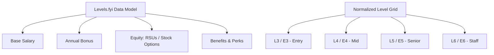

# Competitive Analysis & UX Research: LevelLens

Welcome to the foundational research document for **LevelLens**. This document covers a deep-dive competitive analysis of four primary compensation and career benchmarking platforms: **Levels.fyi**, **6figr**, **AmbitionBox**, and **Glassdoor**. 

This research highlights critical industry gaps, analyzes feature footprints, and defines **five core design decisions** that will guide the development of LevelLens.

---

## 1. Deep-Dive Platform Profiles

### 📊 Levels.fyi
*The Gold Standard for High-Tech Compensation & Level Mapping*



*   **Core Positioning:**
    Targeted specifically at high-skilled tech professionals (Software Engineers, Product Managers, Designers, Data Scientists, etc.). It focuses on crowdsourcing highly granular, high-integrity compensation data from tier-1 and tier-2 tech hubs globally.
*   **Compensation Structure:**
    Superb granularity. It separates compensation into **Base Salary**, **Annual Bonus**, and **Equity (stock grant value per year or over 4 years)**, which combine to form the **Total Compensation (TC)**. It also captures specific equity details (e.g., RSUs vs. stock options, vesting schedules).
*   **Level System:**
    Pioneered normalized leveling across companies. Users can view a side-by-side grid mapping levels across tech giants (e.g., Google L5 = Meta E5 = Apple ICT4 = Microsoft 63/64). This resolves title inflation and fragmentation.
*   **Filtering and Search UX Patterns:**
    Clean, responsive search filters. Users can filter by title, company, location, years of experience (YoE), and specific leveling bands. It features interactive scatter plots showing individual data points over time, and highly legible salary tables.
*   **Location and Cost-of-Living (CoL) Adjustments:**
    Excellent localized drilldown. It groups data into metropolitan areas (e.g., SF Bay Area, NYC, Bangalore) and provides a dedicated "Compare Cities" tool that utilizes cost-of-living indices to show equivalent purchasing power.
*   **Comparison Features:**
    Enables side-by-side comparisons of two or more companies across salary, benefits, levels, and equity structure. Includes interactive line charts and bar graphs for historical trends.
*   **Mobile Experience Quality:**
    Highly polished, responsive mobile web design and lightweight native mobile applications. Tables are swipeable or collapse into card-based views on mobile screens to preserve readability.
*   **Data Freshness Indicators:**
    Individual entries are stamped with exact submission dates. The platform displays real-time tickers of new entries and computes averages based on the last 12 months of submissions to prevent outdated historical records from skewing current market rates.
*   **Notable UX Failures & Frustrations:**
    *   **Level Fragmentation:** When users submit data under non-standard titles, it can lead to cluttered, unmapped entries that fall outside the main comparison ladder.
    *   **Visual Noise:** The homepage has grown increasingly complex, integrating job boards, negotiation consulting, and internship rankings, which can distract from the core salary search.

---

### 📈 6figr
*Career Trajectory Prediction & Mid-to-Senior Executive Benchmarking*

*   **Core Positioning:**
    Focused on professional career growth, career path prediction, and compensation benchmarks for mid-to-senior levels (particularly strong in India and the US, covering finance, tech, and engineering operations).
*   **Compensation Structure:**
    Captures **Base Salary**, **Variable Pay (bonuses/commissions)**, and **Benefits**. It is less detailed regarding complex equity structures (like RSU vesting variations, refreshers, and option valuations), often aggregating them into standard "variable" components.
*   **Level System:**
    Relies heavily on raw job titles and designations (e.g., "Associate Director", "Vice President"). It attempts to map these into broad career stages (e.g., Entry, Mid, Senior, Lead, Executive) but lacks a fine-grained, interactive cross-company normalization grid like Levels.fyi.
*   **Filtering and Search UX Patterns:**
    Features search mechanisms geared around career paths and resumes. Users can filter by company, location, title, and years of experience. The overall layout is dense, text-heavy, and relies heavily on static forms.
*   **Location and Cost-of-Living Adjustments:**
    Standard location-based aggregates (e.g., average salary for a role in London vs. Mumbai). It lacks an interactive, real-time cost-of-living purchasing power converter.
*   **Comparison Features:**
    Focuses on "Career Paths" (showing the probability of moving from Company A to Company B) and peer percentiles. Lacks simple, side-by-side leveling maps and benefit breakdown comparisons.
*   **Mobile Experience Quality:**
    Suboptimal mobile web experience. Pages are heavily cluttered with aggressive advertisements, sticky banners, and tables that require excessive horizontal scrolling without responsive wrapping.
*   **Data Freshness Indicators:**
    Lacks prominent real-time indicators. Many data aggregates feel historical, and the exact timestamps of individual entries are obscured, making it difficult to assess how well they reflect current inflationary job markets.
*   **Notable UX Failures & Frustrations:**
    *   **Aggressive Gating / Paywalls:** Forces users to register, upload a resume, or complete lengthy surveys to see deep insights or unlock comparisons.
    *   **Ad Clutter:** Heavy ad integration distracts from data consumption and significantly harms mobile performance.
    *   **Outdated Visual Aesthetics:** The design relies on old form layouts, plain system fonts, and generic colors, creating a low-trust environment.

---

### 🏢 AmbitionBox
*The Indian Market Powerhouse for Reviews and Cost-to-Company (CTC)*

*   **Core Positioning:**
    A comprehensive career platform (under Info Edge / Naukri) tailored specifically for the Indian job market. It surfaces employee reviews, interview experiences, office photos, and aggregate salary insights across all major Indian industries.
*   **Compensation Structure:**
    Focuses heavily on the Indian standard of **CTC (Cost to Company)**. It highlights the total annual CTC and provides a breakdown of **Fixed Pay (Base)** and **Variable Pay**. However, it is structurally weak at handling US-style high-growth equity (RSUs/Stock Options), reflecting traditional Indian corporate packages.
*   **Level System:**
    Mainly utilizes raw company-specific job titles. It aggregates salary data by experience bands (e.g., 2-5 years of experience for a "Software Engineer") rather than offering an interactive, normalized leveling ladder.
*   **Filtering and Search UX Patterns:**
    Robust auto-complete search for Indian corporate entities. Users can filter salaries by department, years of experience, and location (metro/tier-2 cities in India). Results are displayed using clear percentile curves and bell graphs.
*   **Location and Cost-of-Living Adjustments:**
    Excellent geographical coverage of Indian tier-1, 2, and 3 cities. It does not provide dynamic cost-of-living adjustment calculators, but does list location-specific averages for the same role side-by-side.
*   **Comparison Features:**
    Provides a solid, high-level comparison tool where users can select two companies and compare their overall star ratings, salary averages, and employee-rated benefits (e.g., work-life balance, job security).
*   **Mobile Experience Quality:**
    High-quality, polished mobile web implementation and highly rated native mobile apps. Page layouts are clean, fonts are highly legible, and complex charts are refactored into simple, touch-friendly components.
*   **Data Freshness Indicators:**
    Displays indicators such as "Calculated from X reviews received in the last 1 year". It marks the date range of data aggregation clearly, ensuring users understand the relevance of the average salary figures.
*   **Notable UX Failures & Frustrations:**
    *   **CTC Component Ambiguity:** Indian CTC includes non-cash items (gratuity, employer PF contributions, insurance). The platform does not sufficiently isolate real cash-in-hand from these paper benefits.
    *   **Contribution Walls:** Users are frequently prompted to submit their own salary or review to unlock full company details, interrupting the search flow.

---

### 🌐 Glassdoor
*The Global Workplace Review & Broad-Scale Salary Database*

*   **Core Positioning:**
    The global standard for broad workplace reviews, company culture ratings, interview preparation, and aggregated salaries across all industries (non-tech and tech alike).
*   **Compensation Structure:**
    Displays **Base Pay** and **Additional Pay** (which merges bonuses, profit sharing, commission, and stock bonuses). It lacks granular details on equity vesting schedules, paper wealth calculations for startups, or refresher grants.
*   **Level System:**
    Uses raw job titles submitted by users. Because it caters to every industry (from retail to high finance), it does not have a normalized technical leveling system, leading to confusing overlaps (e.g., "Senior Software Engineer" representing widely different scopes across companies).
*   **Filtering and Search UX Patterns:**
    Features highly mature search inputs with global auto-complete. Filters include company size, industry, location, years of experience, and job function. However, the search experience is increasingly integrated with "Fishbowl" style community forums, which can make locating straight salary facts harder.
*   **Location and Cost-of-Living Adjustments:**
    Deep global database covering hundreds of countries and regional hubs. It lacks a dynamic purchasing power or tax-adjusted cost-of-living tool within its salary dashboard.
*   **Comparison Features:**
    Enables comparison between two companies, but the comparison is heavily focused on corporate culture ratings (e.g., CEO approval, career opportunities, work-life balance) rather than detailed salary, level, or equity metrics.
*   **Mobile Experience Quality:**
    Polished responsive mobile web and native apps. However, the mobile web experience is severely compromised by aggressive prompts forcing users to install the native app to view reviews and salaries.
*   **Data Freshness Indicators:**
    Uses proprietary algorithmic models to estimate "current market value" salaries. While this aggregates historical data, it obscures the actual date of individual submissions, making it difficult to verify real-time market shifts.
*   **Notable UX Failures & Frustrations:**
    *   **Intrusive Gatekeeping:** Highly aggressive contribution blocks. Users must submit a review or salary every 12 months to maintain access, which encourages low-quality "junk" data submissions just to bypass the wall.
    *   **Averaging Out Tech Spikes:** Glassdoor’s algorithmic averaging often lumps top-tier tech firms with traditional firms, under-representing the extreme compensation heights (particularly in equity) of high-growth tech companies.
    *   **Forum Clutter:** The shift towards community-driven forum cards ("Fishbowl") makes the UI feel busy, confusing users who just want quick, structured salary metrics.

---

## 2. Feature Footprint Comparison Table

Below is a direct comparison of the key features across all four platforms, followed by our planned implementation decisions for **LevelLens**.

| Feature | Levels.fyi | 6figr | AmbitionBox | Glassdoor | LevelLens (Build?) |
| :--- | :---: | :---: | :---: | :---: | :--- |
| **Level Normalization** | ✅ Yes | ❌ No | ❌ No | ❌ No | **✅ Yes (Priority 1)** — Direct cross-company leveling matrix for clear mapping. |
| **Cost-of-Living (CoL) Adjustment** | ✅ Yes | ❌ No | ❌ No | ❌ No | **✅ Yes (Priority 1)** — Tax and purchasing power adjusted comparison engine. |
| **Equity Breakdown (RSUs/Options)** | ✅ Yes | ❌ No | ❌ No | ❌ No | **✅ Yes (Priority 1)** — Detailed vesting schedules, growth projections, and cash equivalents. |
| **Anonymous Submissions** | ✅ Yes | ✅ Yes | ✅ Yes | ✅ Yes | **✅ Yes** — Safe, encrypted, fully anonymous reporting with verified backend hooks. |
| **Verified Data Badges** | ✅ Yes | ❌ No | ❌ No | ❌ No | **✅ Yes (Priority 2)** — Verify uploads via paystubs/W2s/Offers with anonymized storage. |
| **Company Profile Pages** | ✅ Yes | ✅ Yes | ✅ Yes | ✅ Yes | **✅ Yes** — Clean, high-impact profiles focused on core salary distributions. |
| **Searchable Salary Tables** | ✅ Yes | ✅ Yes | ✅ Yes | ✅ Yes | **✅ Yes (Priority 1)** — Instant, multi-column sorting and fuzzy search. |
| **Percentile Bands** | ❌ No | ✅ Yes | ✅ Yes | ✅ Yes | **✅ Yes** — Interactive box-and-whisker plots showing 25th, 50th, 75th, and 90th percentiles. |
| **Years of Experience (YoE) Filters** | ✅ Yes | ✅ Yes | ✅ Yes | ✅ Yes | **✅ Yes (Priority 1)** — Separate sliders for Total YoE vs. Company-specific YoE. |
| **Role Filters** | ✅ Yes | ✅ Yes | ✅ Yes | ✅ Yes | **✅ Yes** — Deep categorizations within tech (e.g., Backend, Frontend, DevOps, AI/ML). |
| **Location Filters** | ✅ Yes | ✅ Yes | ✅ Yes | ✅ Yes | **✅ Yes** — Country, Metro Area, Specific City, and Remote-specific filters. |
| **Side-by-Side Comparison** | ✅ Yes | ❌ No | ✅ Yes | ✅ Yes | **✅ Yes (Priority 1)** — Comparative metrics for salary, level matching, and benefits. |
| **Career Ladder View** | ✅ Yes | ❌ No | ❌ No | ❌ No | **✅ Yes (Priority 2)** — Interactive progression maps (e.g., path from Junior to Staff). |
| **Export / Share Tools** | ❌ No | ❌ No | ❌ No | ❌ No | **✅ Yes (Priority 2)** — One-click export to CSV/JSON and clean social share cards. |
| **Mobile Responsiveness** | ✅ Yes | ⚠️ Poor | ✅ Yes | ✅ Yes | **✅ Yes (Priority 1)** — Adaptive layouts designed first-class for mobile devices. |

---

## 3. Design Decisions: Core UX Principles for LevelLens

Based on the critical gaps identified in the competitive landscape, LevelLens will be built upon these **5 defining UX principles**:

### 1. Frictionless Transparency over Contribution Walls (Anti-Gatekeeping)
> [!IMPORTANT]
> **The Problem:** Glassdoor and AmbitionBox severely degrade the user experience by forcing contributions (salary details or reviews) through aggressive overlay walls. This often results in "junk" data submitted by users just trying to read a single page.
>
> **The Decision:** LevelLens will prioritize open access. A high-value tier of aggregate statistics, salary distributions, and leveling matrices will be completely open and un-gated. Verification and contribution badges will be encouraged through positive reinforcement (unlocking premium personalized tools, like stock portfolio tracking or mock negotiation simulators) rather than holding basic data hostage.

### 2. Multi-Company Level Normalization as a First-Class Citizen
> [!TIP]
> **The Problem:** Glassdoor and AmbitionBox display raw titles, leading to massive confusion when mapping an "L5 Senior Engineer" at Google to a "Member of Technical Staff" at Salesforce.
>
> **The Decision:** Every salary page and search interaction in LevelLens will revolve around a standardized, normalized career grid. Users will be able to toggle between "Raw Title" and "Normalized Level" (e.g., LevelLens Level 3 = Entry, Level 5 = Senior, Level 7 = Principal). This normalization engine will be highly visible on all search, profile, and comparison pages.

### 3. Clear & Interactive Compensation Decomposition
> [!NOTE]
> **The Problem:** AmbitionBox lumps everything into CTC, making it hard to identify actual cash-in-hand. Glassdoor obscures equity into "Additional Pay." Levels.fyi has excellent data but lacks interactive projections for equity fluctuations.
>
> **The Decision:** LevelLens will feature a highly visual, interactive compensation breakdown widget. It will isolate **Base Pay**, **Guaranteed Bonus**, **Variable/Performance Bonus**, and **Equity (RSUs/Options)**. It will include a slider allowing candidates to project their total earnings based on potential stock growth rates (e.g., -20% to +50%) and custom vesting schedules (e.g., 25% yearly vs. frontloaded).

### 4. Dynamic Purchasing Power & Localized Tax Adjuster
> [!IMPORTANT]
> **The Problem:** Tech professionals frequently migrate or work remotely, but current tools only provide flat comparisons of city averages without factoring in cost-of-living indexes, localized tax brackets, and local perks.
>
> **The Decision:** We will build a native **Purchasing Power Converter** directly into our comparison pages. When comparing an offer in San Francisco with one in Bangalore or Munich, LevelLens will automatically calculate estimated local income taxes and apply a Purchasing Power Parity (PPP) index. This will show users their actual disposable income equivalent in their home currency.

### 5. High-Signal, Dark-First Minimalist Dashboard (Zero Ad-Spam)
> [!CAUTION]
> **The Problem:** 6figr is rendered almost unusable due to flashing ads, and Glassdoor’s integration with forums creates cognitive overload, detracting from core salary analysis.
>
> **The Decision:** LevelLens will feature a premium, dark-mode-first aesthetic with zero ad-spam. We will prioritize high data density with high visual clarity—using clean typography, subtle borders, box-and-whisker plots, and micro-interactions (e.g., hovering over a chart node dynamically updates an adjacent breakdown card). The focus remains entirely on rapid salary exploration.

---

## 4. Proposed Data Structure (JSON) for Unified Levels
To support these design decisions, LevelLens will utilize a normalized schema. Below is a blueprint of how compensation data will be modeled within the platform:

```json
{
  "submissionId": "ll_sub_987214",
  "timestamp": "2026-05-29T11:15:30Z",
  "company": {
    "name": "Acme Corp",
    "normalizedId": "acme_corp"
  },
  "role": {
    "rawTitle": "Senior Systems Engineer III",
    "normalizedTrack": "Software Engineer",
    "normalizedLevel": 5
  },
  "location": {
    "city": "Bangalore",
    "metroArea": "Bangalore Urban",
    "country": "India",
    "isRemote": false
  },
  "experience": {
    "totalYoE": 7.5,
    "companyYoE": 2.0
  },
  "compensation": {
    "currency": "INR",
    "annualBase": 3200000,
    "annualBonus": 480000,
    "equity": {
      "type": "RSU",
      "totalValueGranted": 4000000,
      "vestingPeriodYears": 4,
      "vestingSchedule": "25/25/25/25",
      "annualizedValue": 1000000
    },
    "calculatedAnnualTotal": 4680000
  },
  "verification": {
    "isVerified": true,
    "method": "paystub_ocr",
    "verifiedDate": "2026-05-29T11:18:00Z"
  }
}
```

This research establishes a clear direction for LevelLens. By avoiding the UX failures of legacy platforms and committing to transparency, normalization, and deep financial clarity, LevelLens is positioned to become the premier career intelligence tool.
